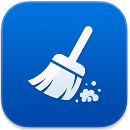

<div align="center">
  
  
  # 空间清理专家 (Clear Sys)

  **面向开发者与极客的轻量级、深度系统空间清理工具（uTools 插件）**

  [](LICENSE)
  [](#)
  [](https://u.tools/)
</div>

## 📖 简介

`clear_sys` 是一款专为开发者和重度电脑用户设计的轻量级磁盘清理工具，作为 **[uTools](https://u.tools/)** 插件运行。
普通的清理软件往往无法触及庞大且隐蔽的开发者缓存（如 Xcode 编译产物、npm 依赖、各类 IDE 缓存等）。本插件针对这些“吃硬盘大户”进行了精准定位，不仅能清理常见的应用缓存，更深入到了各大技术栈的底层缓存，帮助您一键释放数十甚至上百 GB 的磁盘空间。

## ✨ 核心特性

- 🛠 **极致的开发者缓存清理**
  - **移动端**: Xcode DerivedData, iOS DeviceSupport, Android Studio Caches, AVDs
  - **前端与 Node**: npm, yarn, pnpm, nvm 缓存
  - **后端与通用**: Gradle, Maven, Go (mod/build), Rust (Cargo), Pip, Composer
  - **编辑器与 IDE**: VS Code 缓存与编译数据, JetBrains 全系缓存
  - **跨平台**: Flutter (.pub-cache), Dart Analyzer Cache
- 🎮 **大型应用与创意软件专清**
  - Adobe Media Cache (PR/AE 视频缓存)
  - 游戏平台启动器 (Epic Games, Steam)
  - 社交与通讯 (微信, QQ, Discord, Slack)
- 🗂 **大文件深度扫描**
  - 自动扫描并找出体积超过设定阈值（50MB, 100MB, 1GB等）的大文件。
  - 覆盖常用高危积压目录：`Downloads`, `Movies`, `Documents`, `Desktop`。
- 🖥 **原生级的 UI 体验**
  - 采用 Vanilla JS + 原生 CSS 构建，极致轻量，零第三方框架负担。
  - 完美适配 macOS 明暗色主题界面，视觉体验极其顺滑。

## 🚀 安装与使用

### 方式一：通过 uTools 插件中心安装（推荐）
1. 唤出 uTools 搜索框。
2. 搜索 `空间清理专家` 或 `clear`。
3. 点击安装即可使用。

### 方式二：开发者本地打包
如果你想自行修改或二次开发，可以按照以下步骤操作：

1. **克隆项目**
   ```bash
   git clone https://github.com/yourusername/clear_sys.git
   cd clear_sys
   ```
2. **构建打包目录**
   由于 uTools 限制打包目录中不能存在 `.git` 或 `node_modules` 等开发文件，请使用构建脚本生成纯净的 `dist` 目录：
   ```bash
   npm run build
   ```
3. **在 uTools 中加载**
   - 打开 uTools 开发者工具。
   - 选择 `新建项目`，将路径指向项目根目录生成的 `dist/plugin.json` 文件即可进行打包或本地运行。

## 💡 使用说明

1. 唤起 uTools，输入 `清理`、`clean`、`disk` 等关键字。
2. 在 **常规缓存** 页面，您可以勾选需要清理的目标（默认已勾选最安全的缓存项目）。
3. 可以在右上角的“排序方式”中切换“按大小排序”或“按选中状态排序”，方便二次确认。
4. 在 **大文件扫描** 页面，选择文件大小阈值进行全盘扫描，找出占用空间的闲置大文件。

## ⚠️ 免责声明

本工具执行的删除操作会直接调用底层系统接口，被删除的文件通常会直接放入系统废纸篓。清理前请务必确认勾选的项目（如 Android AVD、Docker Virtual Disk、iOS Backups 等由于可能涉及用户业务数据，默认已处于未勾选保护状态）。**请开发者在清楚各项缓存作用的前提下进行清理**。

## 📝 许可证

本项目基于 [MIT License](LICENSE) 协议开源。欢迎 Fork 和 PR 提交更多清理规则！
